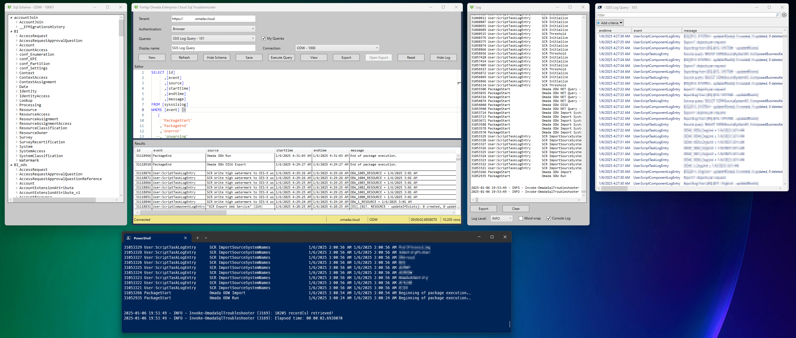
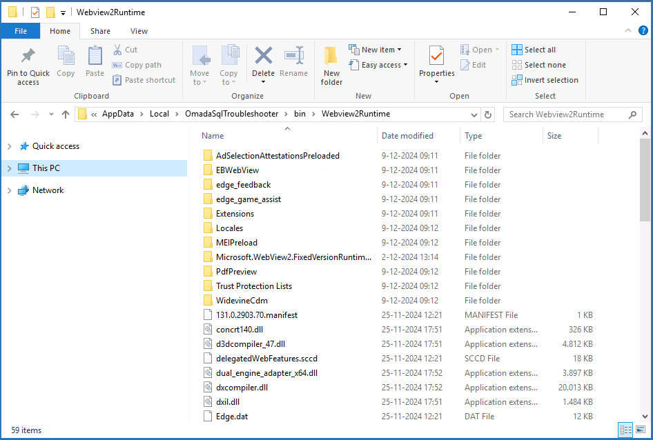

# Omada Sql Troubleshooter
[](https://www.powershellgallery.com/packages/OmadaSqlTroubleshooter) [](https://www.powershellgallery.com/packages/OmadaSqlTroubleshooter) [](https://www.powershellgallery.com/packages/OmadaSqlTroubleshooter) [](https://www.powershellgallery.com/packages/OmadaSqlTroubleshooter) [](https://www.powershellgallery.com/packages/OmadaSqlTroubleshooter)

## DESCRIPTION

OmadaSqlTroubleshooter is a PowerShell Module that contains an interactive desktop application that is used to manage and execute SQL queries stored in the SQL Troubleshooting section in Omada Identity Suite.



### Features:
- Create, update and execute SQL Queries;
- View output in a PowerShell GridView;
- Export output to:
    - json;
    - csv;
    - PowerShell CliXml;
    - Text.
- Save queries without executing;
- Basic IntelliSense for Sql, tables and columns;
- Schema view with the ability to enter the selected item in the editor (SHIFT + Select Table/Column).
- Detailed logging to log window and console;
- Authentication options:
    - Browser based;
    - OAuth.
- Auto complete connection url. Eg. Tenant name completes to https://tenantname.omada.cloud.
- Automatic storing of the current application state, e.g. current connection, current query, application layout, etc.

This application leverages the permissions of the user that is logged in. The application uses the built-in OData endpoint (C_P_SQLTROUBLESHOOTING) for the SQL Troubleshooter and the Omada Enterprise Server API.

> [!IMPORTANT] The C_P_SQLTROUBLESHOOTING OData endpoint is disabled by default. Enabled it in the Data Object Type configuration in Omada in order to use this application.

> [!IMPORTANT] Authentication is handled by the OmadaWeb.PS PowerShell module. This module must be installed before running the application. OmadaWeb.PS can simply be installed using this command:
> ```powershell
> Install-Module -Name OmadaWeb.PS
> ```

## INSTALLATION

To install the module from the PowerShell Gallery, you can use the following command:

```powershell
Install-Module -Name OmadaSqlTroubleshooter
```

## USAGE

### Requirements

This module requires:
- Windows operating system;
- PowerShell 7;
- [OmadaWeb.PS PowerShell Module](https://www.powershellgallery.com/packages/omadaweb.ps);
- [Microsoft Edge WebView2](https://developer.microsoft.com/en-us/microsoft-edge/webview2);
- Omada Identity Cloud with OData enabled for the C_P_SQLTROUBLESHOOTING data object type.

> [!NOTE] If you are not able to install Microsoft Edge Webview2 you can download the Fixed Version x64 bit from [here](https://developer.microsoft.com/en-us/microsoft-edge/webview2). Extract the Cab file using e.g. 7-Zip, copy the contents from folder ```'Microsoft.WebView2.FixedVersionRuntime.xxxx.x64'``` to ```%LOCALAPPDATA%\OmadaSqlTroubleshooter\bin\Webview2Runtime```. The contents of the target folder should now like as shown in the image below.
> <br><br>

### Importing the Module

To import the module, use the following command:

```powershell
Import-Module OmadaSqlTroubleshooter
```

## SYNTAX

### Invoke-OmadaSqlTroubleshooter

```powershell
Invoke-OmadaSqlTroubleshooter [[-LogLevel] <string>] [-Reset] [-LogToConsole] [<CommonParameters>]
```

## EXAMPLES

Here are some example commands you can use with the OmadaSqlTroubleshooter module:

### Example 1: Start OmadaSqlTroubleshooter.
```powershell
Invoke-OmadaSqlTroubleshooter
```

### Example 2: Start OmadaSqlTroubleshooter with LogLevel Debug and log output to console
```powershell
Invoke-OmadaSqlTroubleshooter -LogLevel DEBUG -LogToConsole
```

### Example 3: Reset OmadaSqlTroubleshooter
```powershell
Invoke-OmadaSqlTroubleshooter -Reset
```

## PARAMETERS

### -LogLevel
Set the loglevel. Default is INFO

```yaml
Type: String
Parameter Sets: (All)
Aliases:
Accepted values: INFO, DEBUG, VERBOSE, WARNING, ERROR, FATAL, VERBOSE2

Required: False
Position: 0
Default value: None
Accept pipeline input: False
Accept wildcard characters: False
```

### -LogToConsole
Outputs logging to the console.

```yaml
Type: SwitchParameter
Parameter Sets: (All)
Aliases:

Required: False
Position: Named
Default value: None
Accept pipeline input: False
Accept wildcard characters: False
```

### -Reset
Resets the stored configuration to default.

```yaml
Type: SwitchParameter
Parameter Sets: (All)
Aliases:

Required: False
Position: Named
Default value: None
Accept pipeline input: False
Accept wildcard characters: False
```

### -ProgressAction

```yaml
Type: ActionPreference
Parameter Sets: (All)
Aliases: proga

Required: False
Position: Named
Default value: None
Accept pipeline input: False
Accept wildcard characters: False
```

### CommonParameters
This cmdlet supports the common parameters: -Debug, -ErrorAction, -ErrorVariable, -InformationAction, -InformationVariable, -OutVariable, -OutBuffer, -PipelineVariable, -Verbose, -WarningAction, and -WarningVariable. For more information, see [about_CommonParameters](http://go.microsoft.com/fwlink/?LinkID=113216).

## INPUTS

### None

## OUTPUTS

### None

## NOTES

## RELATED LINKS

[`OmadaWeb.PS`](https://github.com/Fortigi/OmadaWeb.PS)

[Omada Documentation](https://documentation.omadaidentity.com/)
## LICENSE

This project is licensed under the MIT License. See the [LICENSE](LICENSE) file for details.
