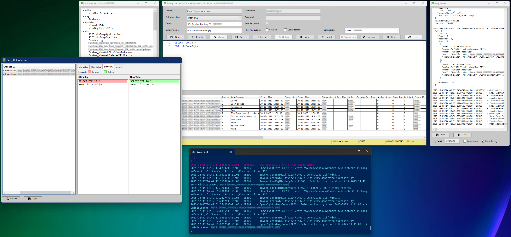
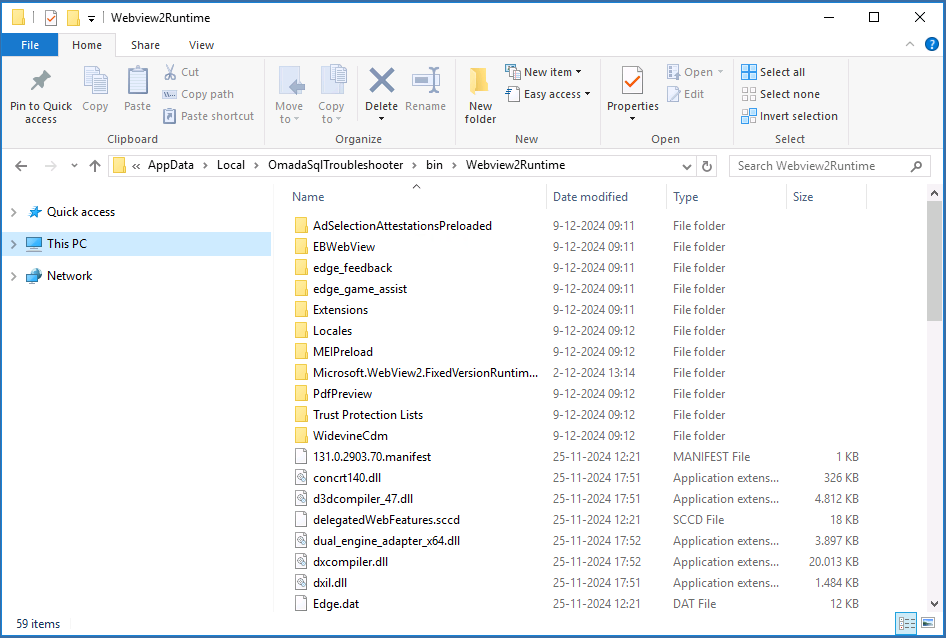

# Omada Sql Troubleshooter
[](https://www.powershellgallery.com/packages/OmadaSqlTroubleshooter) [](https://www.powershellgallery.com/packages/OmadaSqlTroubleshooter) [](https://www.powershellgallery.com/packages/OmadaSqlTroubleshooter) [](https://www.powershellgallery.com/packages/OmadaSqlTroubleshooter)

## DESCRIPTION

OmadaSqlTroubleshooter is a PowerShell Module that contains an interactive desktop application that is used to manage and execute SQL queries stored in the SQL Troubleshooting section in Omada Identity Suite.



### Features

#### Query Management
- Create, update, save and execute SQL queries
- Save queries without executing
- Query history
  - Browse history
  - Restore a query from history
  - Compare changes for each updated query
  - Export historic queries (JSON, CSV, TXT)

#### Editor & IntelliSense
- Context-aware SQL IntelliSense (T-SQL):
  - Tables (schema-qualified) are suggested after `FROM` / `JOIN`
  - Columns are suggested in `SELECT` / `WHERE` / `ON` / `GROUP BY` / `ORDER BY`, scoped to the tables referenced in the statement
  - Table aliases resolve to their columns (e.g. `FROM dbo.Person p` → `p.` completes Person's columns), and column suggestions show their data type
  - Keyword, built-in function and snippet suggestions (e.g. `SELECT … FROM`, `JOIN … ON`, `CASE WHEN`) for SQL syntax
  - The schema is retrieved automatically on connect and when you switch database — no need to open the schema view first
- Schema view — press **Shift + click** on a table or column to insert it into the editor
- Filter queries while typing in the editor

#### Results & Export
- View results in a PowerShell GridView
- Context menu for quick copy, select all and save
- Select cells, columns, rows and copy to clipboard
- Export results to JSON, CSV, PowerShell CliXml or plain text

#### Authentication
- **WebView2** — browser-based via WebView2 (default)
- **Browser** — browser-based via Selenium
- **OAuth** — OAuth2 / Entra ID

#### Tabs & Multiple Connections
- Work with multiple queries and connections side by side, each in its own tab
- Every tab is an independent workspace with its own connection settings, query editor and results
- **Add a tab** — click the **+** button next to the tabs, or use the tab **New Tab** context menu
- **Duplicate a tab** — copy a tab's connection and query into a new, unsaved tab (**Duplicate Tab**), or copy only the connection without the query (**Duplicate Tab without Query**)
- **Close tabs** — close a single tab (its **✕** button or context menu), **Close All But This**, or **Close All**
- **Reorder tabs** — drag a tab to a new position
- Tabs shrink to fit on a single row; long names are truncated with an ellipsis (…)
- New and duplicated tabs are auto-named `Query{#}`, kept unique against your saved queries; the name is pre-filled into the Display name field so a duplicate can be saved with a single click
- A query Display name cannot be empty when saving

##### Shared connections (connection pools)
Tabs that share the same connection form a **connection pool**, identified by the combination of **tenant URL + authentication method + credentials**:
- When a tab connects, every tab in the same pool shares that active connection — no repeated sign-in
- Disconnecting one tab disconnects only that tab; the others in the pool stay connected
- A new tab whose connection settings match an already-connected pool reuses that pool's connection
- A new tab whose settings match no connected pool creates a new pool of its own

#### Connectivity & State
- Auto-complete connection URL (e.g. `tenantname` → `https://tenantname.omada.cloud`)
- Select query or connection from a dropdown while typing
- Automatic persistence of connections, queries, tabs and layout between sessions
- Option to store credentials; WebView2/Browser with Entra ID can auto-fill them
- Detailed logging to log window and console

#### Keyboard Shortcuts

| Shortcut | Action |
|---|---|
| `F5` | Execute query |
| `Enter` (in connection field) | Initiate connection |
| `Ctrl + S` | Save current query in Omada |
| `Ctrl + Shift + K` | Duplicate the current tab (connection and query) |
| `Ctrl + T` | Duplicate the current tab without the query editor contents |
| `Ctrl + W` / `Ctrl + F4` | Close the current tab |
| `Ctrl + Tab` | Switch to the next tab (wraps from the last tab to the first) |
| `Ctrl + Shift + Tab` | Switch to the previous tab (wraps from the first tab to the last) |
| `Ctrl + C` (result pane) | Copy selected cell(s) to clipboard |
| `Ctrl + Shift + C` (result pane) | Copy selected cell(s) including headers to clipboard |
| `Ctrl + Shift + S` (result pane) | Copy selected cell(s) formatted as array for direct use in a Sql query to clipboard |
| `Ctrl + Shift + P` (result pane) | Copy selected cell(s) formatted as array for direct use in a PowerShell query to clipboard |

This application leverages the permissions of the user that is logged in. The application uses the built-in OData endpoint (C_P_SQLTROUBLESHOOTING) for the SQL Troubleshooter and the Omada Enterprise Server API.

> [!IMPORTANT]
> The C_P_SQLTROUBLESHOOTING OData endpoint is disabled by default. Enabled it in the Data Object Type configuration in Omada in order to use this application. Also make sure that you have the correct user permissions to Create, Read and Modify objects via OData.

> [!IMPORTANT]
> Authentication is handled by the OmadaWeb.PS PowerShell module. This module must be installed before running the application. OmadaWeb.PS can simply be installed using this command:
> ```powershell
> Install-Module -Name OmadaWeb.PS
> ```

## INSTALLATION

To install the module from the PowerShell Gallery, you can use the following command:

```powershell
Install-Module -Name OmadaSqlTroubleshooter
```

## USAGE

### Requirements

This module requires:
- Windows operating system;
- PowerShell 7;
- [OmadaWeb.PS PowerShell Module](https://www.powershellgallery.com/packages/omadaweb.ps) (Version 2026.07.09.9 or higher);
- [Microsoft Edge WebView2](https://developer.microsoft.com/en-us/microsoft-edge/webview2);
- Omada Identity Cloud with OData enabled for the C_P_SQLTROUBLESHOOTING data object type;
- Create, Read and Modify user permissions for OData.

> [!NOTE]
> If you are not able to install Microsoft Edge Webview2 you can download the Fixed Version x64 bit from [here](https://developer.microsoft.com/en-us/microsoft-edge/webview2). Extract the Cab file using e.g. 7-Zip, copy the contents from folder ```'Microsoft.WebView2.FixedVersionRuntime.xxxx.x64'``` to ```%LOCALAPPDATA%\OmadaSqlTroubleshooter\bin\Webview2Runtime```. The contents of the target folder should now like as shown in the image below.
> <br><br>

### Importing the Module

To import the module, use the following command:

```powershell
Import-Module OmadaSqlTroubleshooter
```

## SYNTAX

### Invoke-OmadaSqlTroubleshooter

```powershell
Invoke-OmadaSqlTroubleshooter [[-LogLevel] <string>] [-Reset] [-LogToConsole] [<CommonParameters>]
```

## EXAMPLES

Here are some example commands you can use with the OmadaSqlTroubleshooter module:

### Example 1: Start OmadaSqlTroubleshooter.
```powershell
Invoke-OmadaSqlTroubleshooter
```

### Example 2: Start OmadaSqlTroubleshooter with LogLevel Debug and log output to console
```powershell
Invoke-OmadaSqlTroubleshooter -LogLevel DEBUG -LogToConsole
```

### Example 3: Reset OmadaSqlTroubleshooter
```powershell
Invoke-OmadaSqlTroubleshooter -Reset
```

## PARAMETERS

### -LogLevel
Set the loglevel. Default is INFO

```yaml
Type: String
Parameter Sets: (All)
Aliases:
Accepted values: INFO, DEBUG, VERBOSE, WARNING, ERROR, FATAL, VERBOSE2

Required: False
Position: 0
Default value: None
Accept pipeline input: False
Accept wildcard characters: False
```

### -LogToConsole
Outputs logging to the console.

```yaml
Type: SwitchParameter
Parameter Sets: (All)
Aliases:

Required: False
Position: Named
Default value: None
Accept pipeline input: False
Accept wildcard characters: False
```

### -UseWebView2Auth
Uses the WebView2 for browser-based authentication instead of Selenium.

> [!IMPORTANT]
> This parameter is deprecated, select the WebView2 authentication option from the UI instead.

```yaml
Type: SwitchParameter
Parameter Sets: (All)
Aliases:

Required: False
Position: Named
Default value: None
Accept pipeline input: False
Accept wildcard characters: False
```

### -NoReconnect
Prevents the application from attempting to reconnect to the Omada Identity Suite using the stored connection information.

```yaml
Type: SwitchParameter
Parameter Sets: (All)
Aliases:

Required: False
Position: Named
Default value: None
Accept pipeline input: False
Accept wildcard characters: False
```

### -Reset
Resets the stored configuration to default.

```yaml
Type: SwitchParameter
Parameter Sets: (All)
Aliases:

Required: False
Position: Named
Default value: None
Accept pipeline input: False
Accept wildcard characters: False
```

### -ProgressAction

```yaml
Type: ActionPreference
Parameter Sets: (All)
Aliases: proga

Required: False
Position: Named
Default value: None
Accept pipeline input: False
Accept wildcard characters: False
```

### CommonParameters
This cmdlet supports the common parameters: -Debug, -ErrorAction, -ErrorVariable, -InformationAction, -InformationVariable, -OutVariable, -OutBuffer, -PipelineVariable, -Verbose, -WarningAction, and -WarningVariable. For more information, see [about_CommonParameters](http://go.microsoft.com/fwlink/?LinkID=113216).

## INPUTS

### None

## OUTPUTS

### None

## NOTES

### None

## KNOWN ISSUES

> [!NOTE]
> **Queries that return no rows and queries that fail show the same warning.**
> The message _"Warning: Query did not return any results!"_ is displayed in both cases.
> This is a limitation of the SQL Troubleshooter component in Omada Identity Suite,
> which does not distinguish between an empty result set and a query execution failure.

## DATA HANDLING & PRIVACY

OmadaSqlTroubleshooter is used by identity professionals against production IGA data, so it is
worth stating plainly — and checkably — what the application does with that data.

In short: **the application sends no telemetry, all identity data flows only between your
machine and your own Omada tenant, and everything it keeps is kept locally in your own Windows
user profile.**

### No telemetry

The module contains no analytics, telemetry, usage-tracking or crash-reporting code, and no
such SDK is bundled. Nothing about you, your tenant, your queries or your results is sent to
Fortigi or to any third party.

Every destination the module can contact is hard-coded in the source and listed below; there
are no others. You can verify this for yourself in two ways: search the module source for
`http`, or start the application with `Invoke-OmadaSqlTroubleshooter -LogLevel VERBOSE
-LogToConsole` and watch every request it makes.

### Where the application connects

| Destination | When | What is sent | Why |
|---|---|---|---|
| **Your Omada tenant** (`https://<tenant>.omada.cloud` or the URL you enter) | While connected | Your SQL query text, saved query metadata and OData requests; the session credential or token for the tenant | This is the application's actual work: the SQL Troubleshooter OData endpoint (`C_P_SQLTROUBLESHOOTING`) and the Omada Enterprise Server API |
| **Your identity provider** (Entra ID or the tenant's own sign-in page) | On sign-in only | Your credentials, handled by the browser/WebView2 sign-in flow of [OmadaWeb.PS](https://github.com/Fortigi/OmadaWeb.PS) | Authentication |
| `api.nuget.org` and `www.nuget.org` | On module import | Nothing but the package request itself | Resolve and download the Microsoft WebView2 .NET SDK — see [THIRD-PARTY-NOTICES.md](THIRD-PARTY-NOTICES.md) |
| `www.powershellgallery.com` | On module import, and only when the module was installed from the PowerShell Gallery | The module name, in a public package-lookup request | Warn you when a newer version is available |

The last two are ordinary package requests to Microsoft-operated services. They carry no
tenant name, no user name and no query data. No other host is contacted by this module.

### Data stored on your machine

All of it lives in your own Windows user profile. Nothing is written to a shared or roaming
location beyond `%APPDATA%`, and nothing is written outside your profile.

| Path | Contents | Protection | Lifetime | How to clear |
|---|---|---|---|---|
| `%APPDATA%\OmadaSqlTroubleshooter\config\OmadaSqlTroubleshooter.json` | Application settings only: log level, window positions and sizes, last-used export folder and file type, tab capacity, and `InstanceGuid` (see below). No credentials, no query text, no results. | NTFS permissions on your profile | Until deleted | `Invoke-OmadaSqlTroubleshooter -Reset` restores defaults, or delete the file |
| `%APPDATA%\OmadaSqlTroubleshooter\config\tabs.clixml` | Per-tab session state written when the application closes: tenant URL, user name, Entra application ID URI and tenant ID, the selected data connection, the *name* of the selected saved query, and — only if you ticked **Save password** — your password. The SQL text itself is not stored here; it lives in your Omada tenant. | The password field is encrypted with Windows DPAPI, bound to your Windows user account on that machine. The remaining fields are stored as plain CliXml. | Overwritten at each close; kept until deleted | `Invoke-OmadaSqlTroubleshooter -Reset` deletes the file, or delete it yourself |
| `%LOCALAPPDATA%\OmadaSqlTroubleshooter\Bin\...` | The Microsoft WebView2 .NET SDK assemblies downloaded from NuGet. No user data. | NTFS permissions on your profile | Until deleted; refreshed when a newer SDK is released | Delete the folder; it is re-downloaded on the next import |
| `%LOCALAPPDATA%\OmadaSqlTroubleshooter\Edge User Data\OmadaWebView2Profile` | A WebView2 browser-profile folder created when the first tab's editor starts. It is created but not currently used as a profile location — the editor's WebView2 uses the `%TEMP%` folder below — so it stays empty. | NTFS permissions on your profile | Until deleted | Delete the folder |
| `%TEMP%\OmadaSqlTroubleshooter` | The WebView2 user-data folder (browser cache and local storage) for the editor. This WebView2 instance only ever loads the local Monaco editor page — it never loads Omada or a sign-in page, so it holds no session cookies and no tenant data. | NTFS permissions on your profile | Until deleted; `%TEMP%` is not cleared automatically by the application | Delete the folder while the application is closed |
| `%LOCALAPPDATA%\OmadaSqlTroubleShooter\Run.ps1`, plus Start Menu and Desktop shortcuts | A small launcher script and shortcuts. No user data. | NTFS permissions on your profile | Until deleted | Delete the file and the shortcuts |
| Files you export | Query results, query history, or the application log — see the next section | Whatever you choose; the application applies no encryption | Until you delete them | Delete them |

Two details worth knowing:

- **`InstanceGuid`** is a random GUID generated on first run and stored in the settings file. It
  is never transmitted to Fortigi or to any third party. Its only use is to give the temporary
  query object that the application creates *inside your own tenant* a stable name
  (`TMP_<InstanceGuid>`), so repeated runs reuse one object instead of leaving new ones behind.
- On the very first run, before `%APPDATA%\OmadaSqlTroubleshooter` exists, the settings file is
  written next to the installed module instead. From the next run onwards it is read and
  written under `%APPDATA%`.

Authentication cookies, tokens and browser profiles used for signing in are managed by the
[OmadaWeb.PS](https://github.com/Fortigi/OmadaWeb.PS) module, not by this one; see that
module's documentation for where it caches them and how to clear them.

### What exports and logs can contain

Query results are production identity data. Treat them accordingly.

- **Exported result files** (JSON, CSV, CliXml, plain text) and **clipboard copies** contain the
  full rows your query returned. Depending on the query, that can include personal data such as
  names, e-mail addresses, employee identifiers, manager relationships and account details.
  Files are written unencrypted, to a location you choose.
- **Exported query history** contains the SQL text, its change history and the names of the
  users who created or modified each query.
- **The application log** records connection URLs, user names and application events. It is
  designed to be shareable: every request, response and result set reaches it through a single
  redaction layer, so an exported log should never need scrubbing before you attach it to a
  support ticket. At every log level, including `VERBOSE` and `VERBOSE2`:
  - `Authorization` headers, session cookies and tokens are masked.
  - Passwords are held as `SecureString`/`PSCredential` and are never written in readable form.
    The account's user name is recorded, because knowing which account authenticated is what
    makes a permission failure diagnosable.
  - Request bodies are recorded as their field names and value shapes, not their values.
  - Result sets are recorded as row and column counts plus column names — **never cell values**.

  Result data therefore does not reach the log at any level. This applies to the log only; the
  export and clipboard paths above are unaffected and still contain full rows by design.

### Your responsibilities

Once you export a result set or copy rows to the clipboard, that data leaves the application's
control and becomes your organisation's responsibility to handle under its own data-protection
obligations — the GDPR included, where it applies. In practice:

- Export only the columns and rows you actually need, and prefer filtering in the query.
- Store exports on encrypted, access-controlled storage — not in a personal downloads folder,
  a shared drive, a ticket attachment or a chat message.
- Delete exports as soon as the troubleshooting task is finished; there is no automatic cleanup.
- Remember that a query and its results are visible in Omada under your account, and that the
  application acts only with the permissions of the signed-in user.

### Scope of this statement

This statement covers the OmadaSqlTroubleshooter module. Authentication is performed by the
separate [OmadaWeb.PS](https://github.com/Fortigi/OmadaWeb.PS) module, and the Microsoft Edge
WebView2 Runtime is a Microsoft component installed on your machine; both are governed by their
own documentation and terms. Third-party components are inventoried in
[THIRD-PARTY-NOTICES.md](THIRD-PARTY-NOTICES.md).

If you find a statement here that does not match what the code does, please
[open an issue](https://github.com/Fortigi/OmadaSqlTroubleshooter/issues) — an inaccurate
privacy statement is a bug.

## CONTRIBUTING

Contributions are welcome! If you have ideas for improvements or bug fixes, feel free to open a pull request on [GitHub](https://github.com/Fortigi/OmadaSqlTroubleshooter).

## RELATED LINKS

[`OmadaWeb.PS`](https://github.com/Fortigi/OmadaWeb.PS)

['Omada Documentation'](https://documentation.omadaidentity.com/)
## LICENSE

This project is licensed under the MIT License. See the [LICENSE](LICENSE) file for details.

### Third-party components

OmadaSqlTroubleshooter bundles the Monaco editor, downloads the Microsoft WebView2 .NET SDK at
run time, and requires the Microsoft Edge WebView2 Runtime and the OmadaWeb.PS module. Every
such component, its version, its licence and where it comes from is listed in
[THIRD-PARTY-NOTICES.md](THIRD-PARTY-NOTICES.md), which also records the review confirming that
this project does not redistribute the WebView2 Runtime.
